**Integracion Delta Afiliados**

#### Tabla de contenido

- [Descripción de la necesidad](#descripción-de-la-necesidad)
- [Diagrama de la necesidad](#diagrama-de-la-necesidad)
- [Clasificacion de las Interfaces](#clasificacion-de-las-interfaces)
- [Atributos de calidad de la solucion](#atributos-de-calidad-de-la-solucion)
- [Diagrama de componentes de la Interfaz](#diagrama-de-componentes-de-la-interfaz)
- [Consideraciones](#consideraciones)
- [Mapeo de datos](#mapeo-de-datos)
- [Mapeo Topic  ZSUB_ORDERS_DT](#mapeo_tabla_orders)
- [Mapeo Topic ZSUB_COMPANY_DT](#mapeo_tabla_company)
- [Mapeo Topic ZSUB_LEGALREP_DT](#mapeo_tabla_legalrep)
- [Mapeo Topic ZSUB_TITULATE_DT](#mapeo_tabla_titulate)
- [Mapeo Topic ZSUB_ZSUB_PAC_DT](#mapeo_tabla_pac)
- [Mapeo Topic ZSUBT_CAT_TDOCBP](#mapeo_tabla_cat_tdocbp)
- [Características técnicas de la Interfaz](#características-técnicas-de-la-interfaz)
- [Manejo de Errores](#manejo-de-errores)
- [Manejo de reproceso](#manejo-de-reproceso)
- [Manual de despliegue](#manual-de-despliegue)

* [Inventario de Artefactos](#inventario-de-artefactos)
* [Topologías](#topologías)
* [Directorios](#directorios)
* [Operaciones de la Interfaz (Servicio)](#Operaciones-de-la-Interfaz-(Servicio))

#### Descripción de la necesidad

| **Nombre de la interfaz:** | **NOMBRE DE LA INTERACIÓN O API**                                                                                             |
| -------------------------- |-------------------------------------------------------------------------------------------------------------------------------|
| **Qué**                    | Centralizar los datos de los afiliados en cosmos db trayendolos de el broker de kafka                                         |
| **Porqué**                 | Porque esto facilita el proceso de consulta y disminuye los tiempos que tarda en disponibilizar la informacion                |
| **Para que**               | Para que mas areas de comfama puedan tener acceso de forma rapida a la información, ademas de centralizar toda la informacion |

#### Diagrama de la necesidad

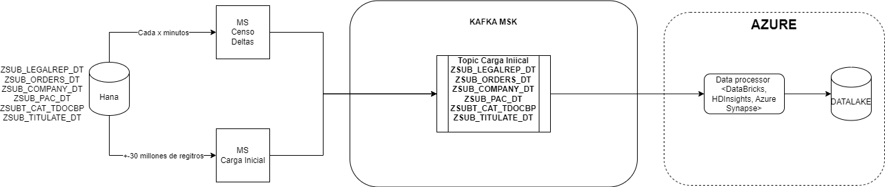

Para este desarrollo cumpliremos con la carga inicial por lo tanto el alcance esta dado por el microservicio que toma datos desde sap Hana y los disponibiliza en Kafka

#### Atributos de calidad de la solución

En la siguiente tabla se relacionan los atributos de calidad asociados a la solución:

| **Seguridad**                                                |                 |      |
| ------------------------------------------------------------ | --------------- | ---- |
| **Característica**                                           | **Observación** |      |
| Identificación y Autenticación                               |       no        |      |
| Autorización                                                 |       no        |      |
| Confidencialidad                                             |       si        |      |
| Integridad                                                   |       si        |      |
| Auditabilidad                                                |       si        |      |
| **Desempeño**                                                |                 |      |
| **Característica**                                           | Máxima capacidad de transmisión y procesamiento que puede ser alcanzado bajo circunstancias ideales. Se espera poder obtener un throughput de 1MB/seg tanto en la producción como el consumo.  |      |
| Transacciones por Segundo                                    |       si        |      |
| Tiempo de Respuesta Máximo en Segundos                       |       si        |      |
| Tiempo de Respuesta Promedio en Segundos                     |       si        |      |
| Frecuencia                                                   |       si        |      |
| Registros entregados en orden                                |                 |      |
| **Escalamiento**                                             |                 |      |
| **Característica**                                           | Habilidad para manejar una cantidad creciente de operaciones. Se pretende tener un sistema que permita escalamiento horizontal, que significa estar en capacidad de agregar o remover nodos al mismo. |      |
| Cantidad Estimada de Transacciones por Día/Mes/Año           |                 |      |
| Porcentaje de Crecimiento Estimado de Transacciones por Día/Mes/Año (%) |                 |      |
| **Disponibilidad**                                           |                 |      |
| **Característica**                                           | La disponibilidad es el porcentaje de tiempo que un sistema es capaz de realizar las funciones para las que está diseñado. En lo que se refiere a los sistemas de mensajería, la disponibilidad es el porcentaje de tiempo que el servicio de mensajería está activo y en funcionamiento.      |
| Horario de Disponibilidad de la Solución                     |       si        |      |
| Contingencia                                                 |       si        |      |
| **Manejo de errores**                                        |                 |      |
| **Característica**                                           | Capacidad que tiene un sistema o aplicación para recuperarse en caso de que ocurran fallas |      |
| Trazabilidad                                                 |       si        |      |
| Endpoint o Partition Key                                     |       si        |      |
| Errores                                                      |       si        |      |
| Alertamiento                                                 |       si        |      |
| Monitoreo                                                    |       no        |      |
| Reintentos                                                   |       si        |      |

#### Diagrama de componentes de la Interfaz

En el siguiente diagrama de componentes se muestra el diseño de la integración y la relación con los diferentes componentes:
Diagrama ejemplo para ODI:

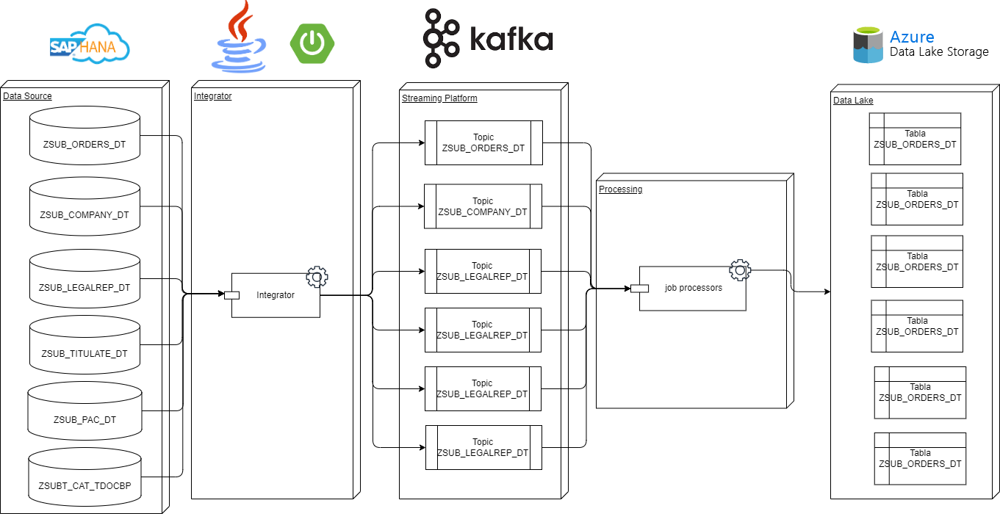

#### Mapeo de datos

#### Mapeo de datos topic ZSUB_ORDERS_DT

Asi se ven los datos en los topics de kafka:
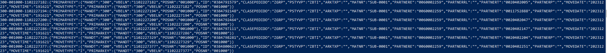

Así se ve la tabla en la base de datos de comos:
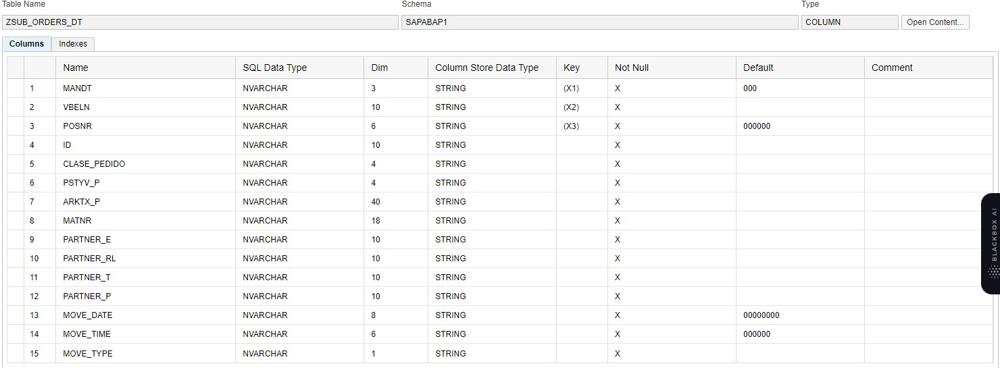

#### Mapeo de datos topic ZSUB_COMPANY_DT

Asi se ven los datos en los topics de kafka:
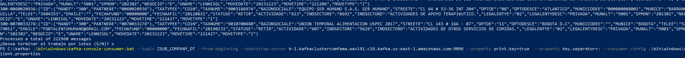

Así se ve la tabla en la base de datos:
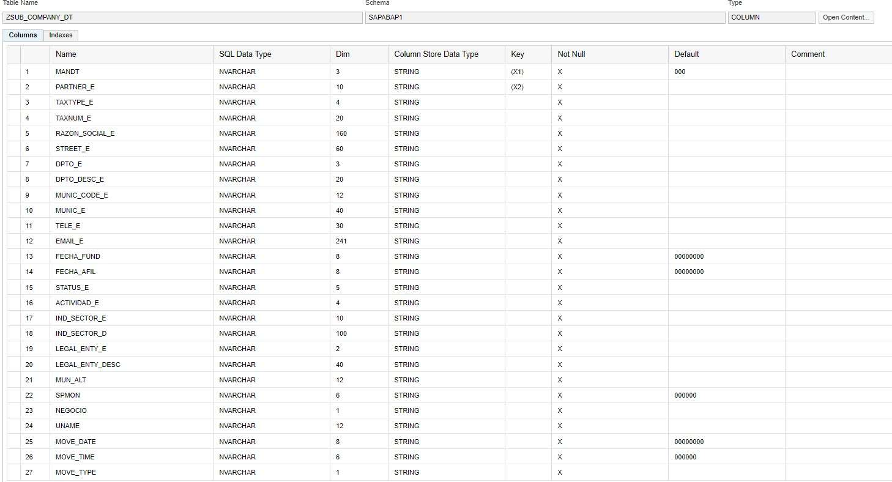

#### Mapeo de datos topic ZSUB_LEGALREP_DT

Asi se ven los datos en los topics de kafka:
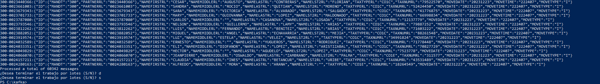

Así se ve la tabla en la base de datos:
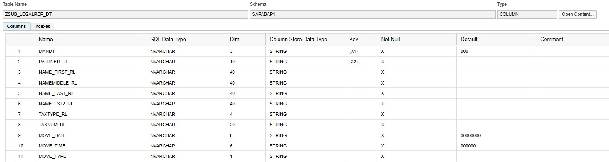

#### Mapeo de datos topic ZSUB_TITULATE_DT

Asi se ven los datos en los topics de kafka:
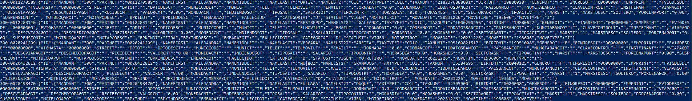

Así se ve la tabla en la base de datos:
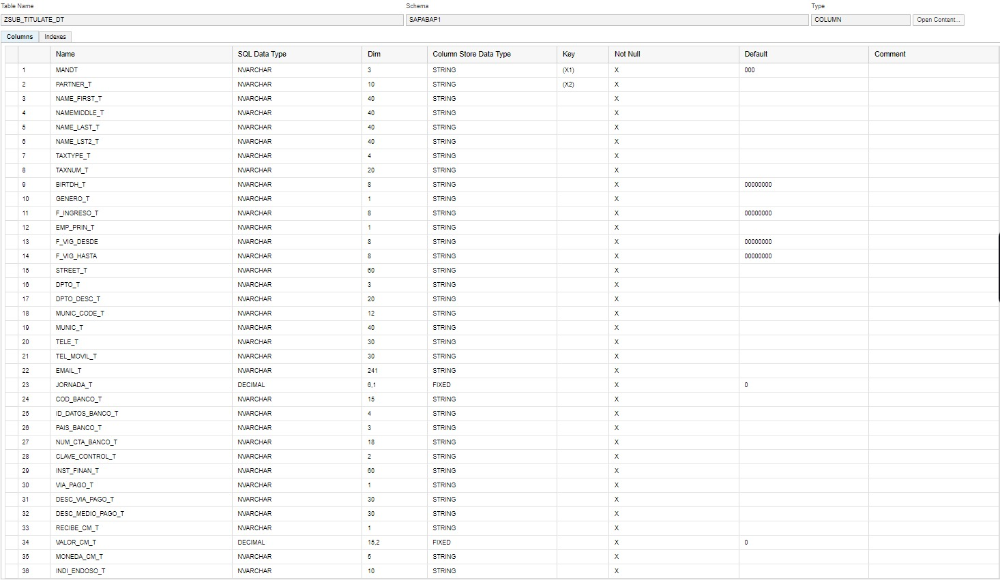
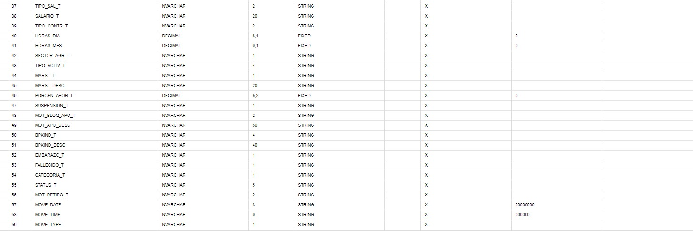

#### Mapeo de datos topic ZSUB_ZSUB_PAC_DT

Asi se ven los datos en los topics de kafka:
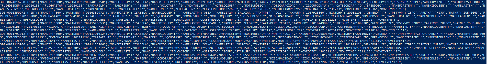

Así se ve la tabla en la base de datos:
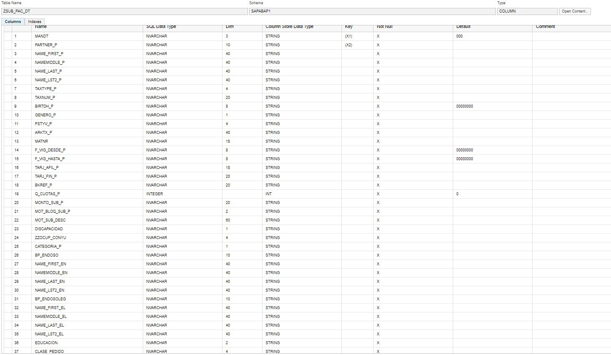
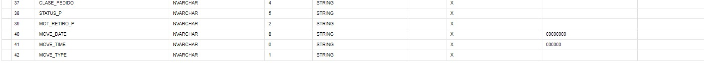

#### Mapeo de datos topic ZSUBT_CAT_TDOCBP
Asi se ven los datos en los topics de kafka:
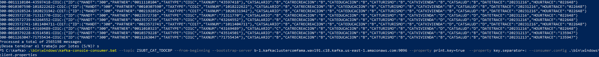

Así se ve la tabla en la base de datos:
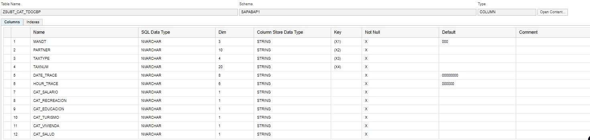

# cosmosdb-kafka-integrator
